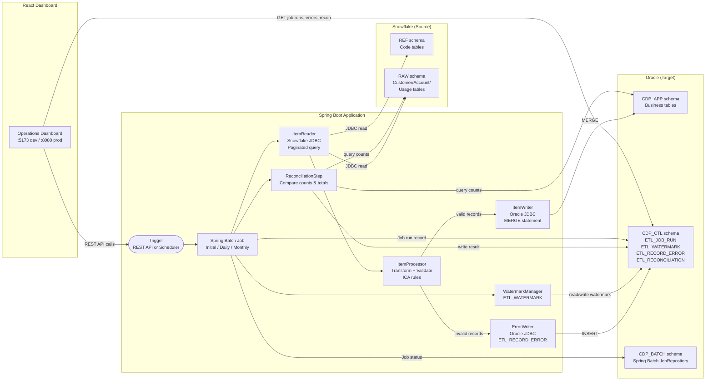
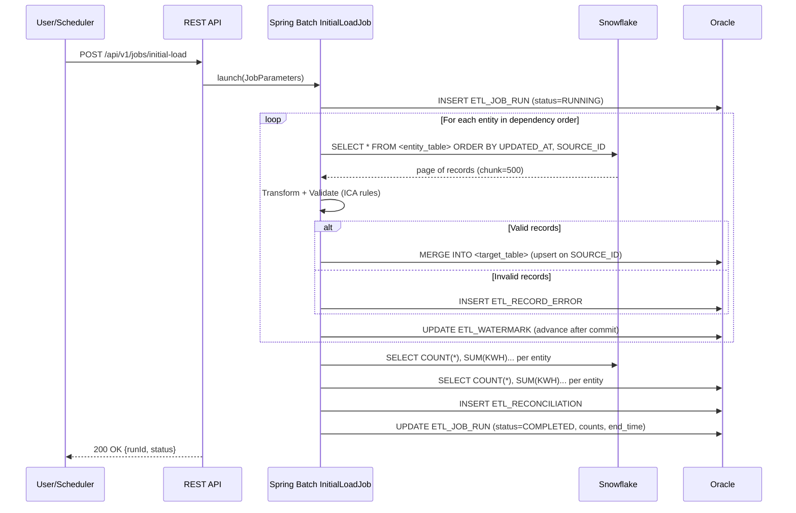
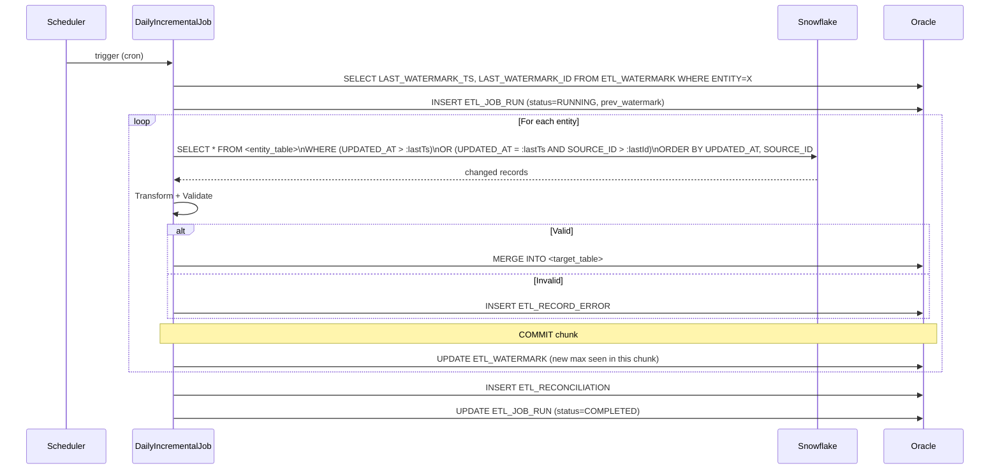
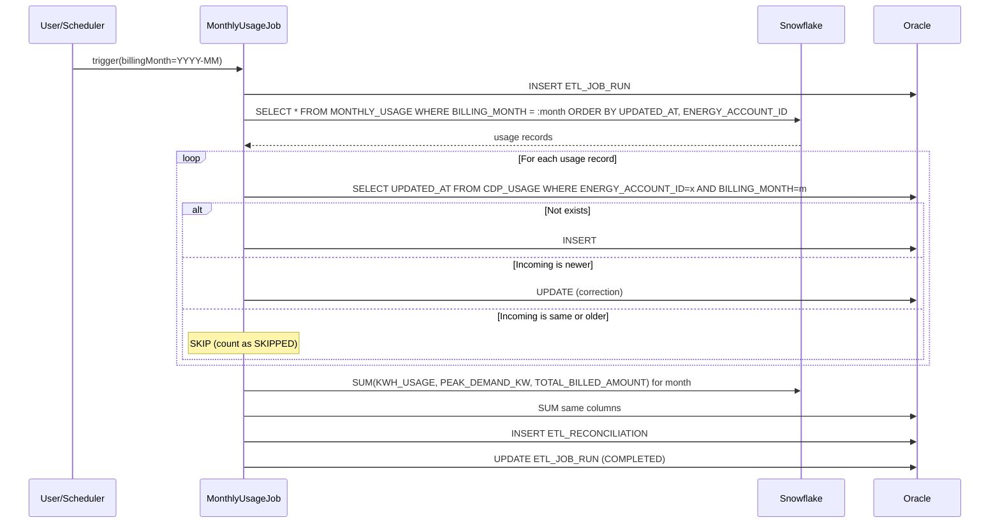
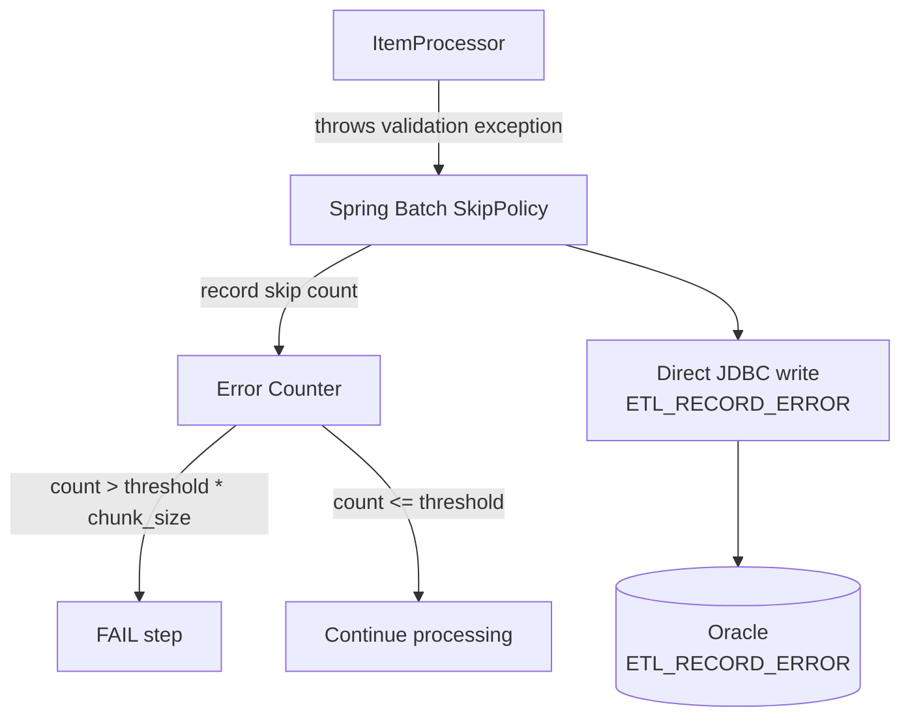
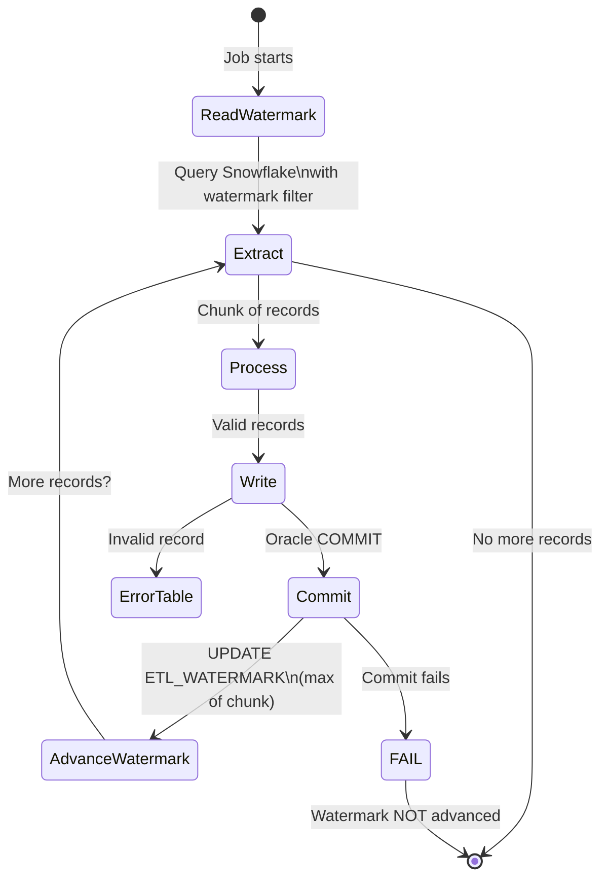

# Data Flow

**Document ID:** ARCH-002  
**Project:** CDP Snowflake to Oracle Data Loader  
**Version:** 1.0  
**Status:** Phase 1 — Approved  
**Last Updated:** 2025 (Phase 1)

---

## 1. High-Level Data Flow

---

## 2. Initial Load Data Flow

---

## 3. Daily Incremental Load Data Flow

---

## 4. Monthly Usage Load Data Flow

---

## 5. Error Record Flow

**Fields written to `ETL_RECORD_ERROR`:**

| Field | Value |
|-------|-------|
| `JOB_NAME` | e.g., `DailyIncrementalJob` |
| `RUN_ID` | Spring Batch `JobExecution` ID |
| `SOURCE_ENTITY` | e.g., `CUSTOMER` |
| `SOURCE_RECORD_ID` | Source primary key (non-PII) |
| `ERROR_CODE` | Structured code, e.g., `VAL-EMAIL-001` |
| `ERROR_MESSAGE` | Human-readable description |
| `PAYLOAD_EXCERPT` | Non-PII fields only, truncated at 500 chars |
| `OCCURRED_AT` | UTC timestamp |

---

## 6. Watermark Advancement Protocol

---

## 7. Reconciliation Flow

After each load job completes, a reconciliation step:

1. Queries Snowflake for source counts and aggregates per entity
2. Queries Oracle `CDP_APP` for target counts and aggregates
3. Computes differences
4. Writes one `ETL_RECONCILIATION` row per entity with:
   - Source count, target count, difference
   - Source KWH sum, target KWH sum (monthly usage only)
   - Source billed total, target billed total (monthly usage only)
   - Pass/fail indicator (`RECON_STATUS`)
5. Updates `ETL_JOB_RUN.RECON_STATUS`

Reconciliation tolerance: ±0 records (exact match required unless errors explain the difference).
