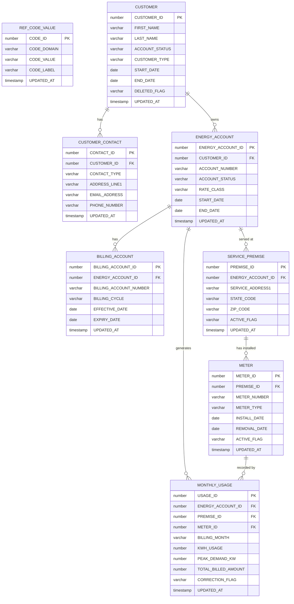
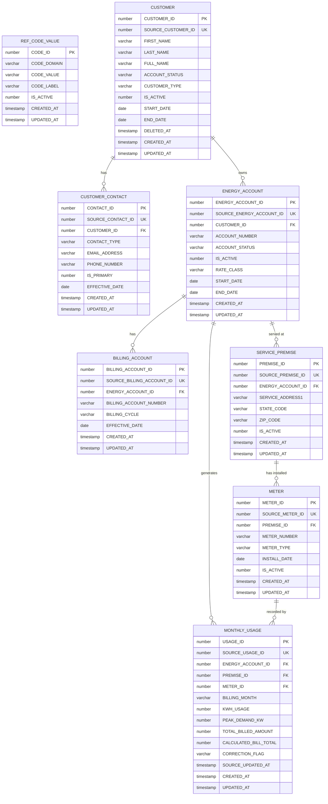
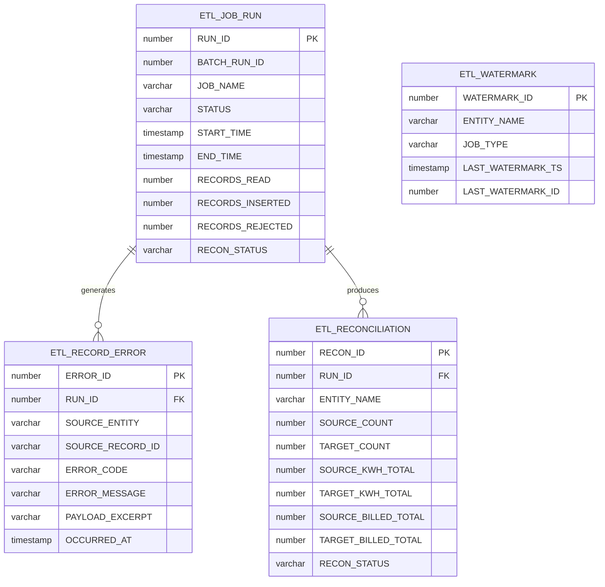
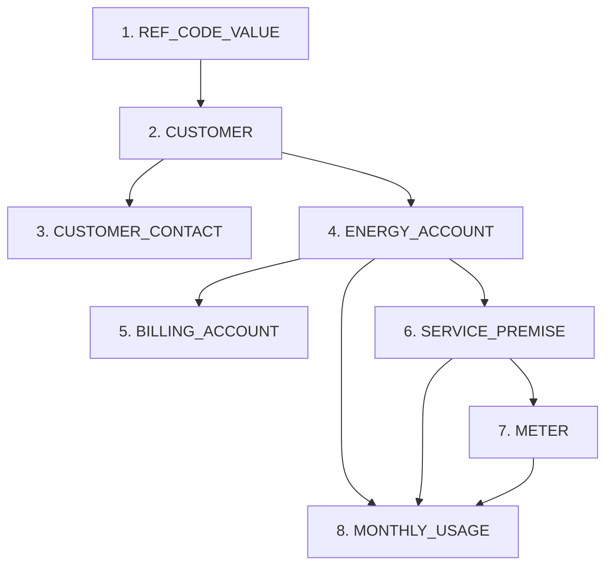

# Entity Relationships

**Document ID:** DM-003  
**Project:** CDP Snowflake to Oracle Data Loader  
**Version:** 1.0  
**Status:** Phase 1 — Approved  
**Last Updated:** 2025 (Phase 1)

---

## 1. Source Entity Relationship Diagram (Snowflake)

---

## 2. Target Entity Relationship Diagram (Oracle CDP_APP)

---

## 3. ETL Control Table Relationships

---

## 4. Load Dependency Order

The following order must be observed when loading entities to satisfy foreign-key constraints:

---

## 5. Source-to-Target Key Mapping Summary

| Source Table | Source PK | Target Table | Source PK stored as | Target PK |
|---|---|---|---|---|
| REF.CODE_VALUE | CODE_ID | CDP_APP.REF_CODE_VALUE | SOURCE_CODE_ID | CODE_ID (sequence) |
| RAW.CUSTOMER | CUSTOMER_ID | CDP_APP.CUSTOMER | SOURCE_CUSTOMER_ID | CUSTOMER_ID (sequence) |
| RAW.CUSTOMER_CONTACT | CONTACT_ID | CDP_APP.CUSTOMER_CONTACT | SOURCE_CONTACT_ID | CONTACT_ID (sequence) |
| RAW.ENERGY_ACCOUNT | ENERGY_ACCOUNT_ID | CDP_APP.ENERGY_ACCOUNT | SOURCE_ENERGY_ACCOUNT_ID | ENERGY_ACCOUNT_ID (sequence) |
| RAW.BILLING_ACCOUNT | BILLING_ACCOUNT_ID | CDP_APP.BILLING_ACCOUNT | SOURCE_BILLING_ACCOUNT_ID | BILLING_ACCOUNT_ID (sequence) |
| RAW.SERVICE_PREMISE | PREMISE_ID | CDP_APP.SERVICE_PREMISE | SOURCE_PREMISE_ID | PREMISE_ID (sequence) |
| RAW.METER | METER_ID | CDP_APP.METER | SOURCE_METER_ID | METER_ID (sequence) |
| RAW.MONTHLY_USAGE | USAGE_ID | CDP_APP.MONTHLY_USAGE | SOURCE_USAGE_ID | USAGE_ID (sequence) |

The target surrogate key is generated from an Oracle sequence on INSERT and never changes. The source ID is stored for MERGE operations and watermark tracking.
