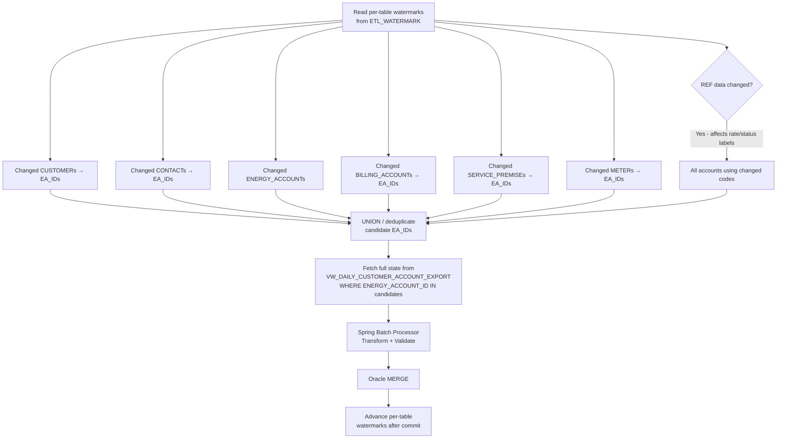

# ICA Context Document 09 — Incremental Loading and Watermark Rules

**ICA Document ID:** ICA-09  
**Project:** CDP Snowflake to Oracle Data Loader  
**Version:** 1.1 (Phase 1 Amendment)  
**Status:** Phase 1 — Amended  
**Last Updated:** 2025 (Phase 1 Amendment)

---

## 1. Purpose

This document defines the watermark strategy and all rules governing incremental data extraction from multi-source Snowflake tables, per-table watermark management, multi-source change-candidate detection, watermark advancement, restart safety and idempotency.

**Amendment note:** This document replaces the original single-entity watermark design with a multi-source, change-candidate-union strategy that correctly handles changes across contributing tables (CUSTOMER, CUSTOMER_CONTACT, ENERGY_ACCOUNT, BILLING_ACCOUNT, SERVICE_PREMISE, METER and REF.CODE_VALUE).

---

## 2. Watermark Design

### 2.1 Composite Per-Table Watermark

Each contributing source table has its own watermark row in `CDP_CTL.ETL_WATERMARK`, keyed by `(TABLE_NAME, JOB_TYPE)`.

The watermark remains a composite of two fields:

| Field | Type | Description |
|-------|------|-------------|
| `LAST_WATERMARK_TS` | TIMESTAMP (UTC) | The `UPDATED_AT` value of the last record successfully committed from that table |
| `LAST_WATERMARK_ID` | NUMBER(15) | The source primary key of the last record at that timestamp |

**Why per-table and not per-logical-entity?**  
The logical daily extraction dataset (VW_DAILY_CUSTOMER_ACCOUNT_EXPORT) joins 7 source tables. Each table has an independent ID domain and independent `UPDATED_AT` progression. A single watermark cannot span tables with unrelated PK sequences. Maintaining per-table watermarks and UNIONing affected keys is the correct multi-source strategy.

### 2.2 Tables with Independent Watermarks

| Table Name | Primary Key | ID Domain |
|------------|------------|-----------|
| `RAW.CUSTOMER` | `CUSTOMER_ID` | Customer sequence |
| `RAW.CUSTOMER_CONTACT` | `CONTACT_ID` | Contact sequence |
| `RAW.ENERGY_ACCOUNT` | `ENERGY_ACCOUNT_ID` | Energy account sequence |
| `RAW.BILLING_ACCOUNT` | `BILLING_ACCOUNT_ID` | Billing account sequence |
| `RAW.SERVICE_PREMISE` | `PREMISE_ID` | Premise sequence |
| `RAW.METER` | `METER_ID` | Meter sequence |
| `REF.CODE_VALUE` | `CODE_ID` | Code sequence |
| `RAW.MONTHLY_USAGE` | `USAGE_ID` | Usage sequence |

Each table is watermarked independently. IDs from different tables are **never compared or ordered against each other**.

---

## 3. Multi-Source Change-Candidate Detection

### 3.1 Problem Statement

A change to CUSTOMER_CONTACT does not update `CUSTOMER.UPDATED_AT`. A change to BILLING_ACCOUNT does not update `ENERGY_ACCOUNT.UPDATED_AT`. If the ETL only checks `CUSTOMER.UPDATED_AT`, contact and billing changes are missed.

### 3.2 Change-Candidate Union Strategy

The Spring Batch daily job executes a change-candidate detection query for each contributing table, unions the affected ENERGY_ACCOUNT_ID keys, deduplicates them, and then performs a full join against the current source state (the view) for those keys.

#### Step 1 — Find affected ENERGY_ACCOUNT_IDs from each table

```sql
-- Changed customers
SELECT ea.ENERGY_ACCOUNT_ID
FROM   RAW.CUSTOMER c
JOIN   RAW.ENERGY_ACCOUNT ea ON ea.CUSTOMER_ID = c.CUSTOMER_ID
WHERE  (c.UPDATED_AT > :cust_last_ts)
    OR (c.UPDATED_AT = :cust_last_ts AND c.CUSTOMER_ID > :cust_last_id)

UNION

-- Changed contacts (any contact for this customer)
SELECT ea.ENERGY_ACCOUNT_ID
FROM   RAW.CUSTOMER_CONTACT cc
JOIN   RAW.ENERGY_ACCOUNT ea ON ea.CUSTOMER_ID = cc.CUSTOMER_ID
WHERE  (cc.UPDATED_AT > :contact_last_ts)
    OR (cc.UPDATED_AT = :contact_last_ts AND cc.CONTACT_ID > :contact_last_id)

UNION

-- Changed energy accounts
SELECT ENERGY_ACCOUNT_ID
FROM   RAW.ENERGY_ACCOUNT
WHERE  (UPDATED_AT > :ea_last_ts)
    OR (UPDATED_AT = :ea_last_ts AND ENERGY_ACCOUNT_ID > :ea_last_id)

UNION

-- Changed billing accounts
SELECT ba.ENERGY_ACCOUNT_ID
FROM   RAW.BILLING_ACCOUNT ba
WHERE  (ba.UPDATED_AT > :ba_last_ts)
    OR (ba.UPDATED_AT = :ba_last_ts AND ba.BILLING_ACCOUNT_ID > :ba_last_id)

UNION

-- Changed premises
SELECT sp.ENERGY_ACCOUNT_ID
FROM   RAW.SERVICE_PREMISE sp
WHERE  (sp.UPDATED_AT > :sp_last_ts)
    OR (sp.UPDATED_AT = :sp_last_ts AND sp.PREMISE_ID > :sp_last_id)

UNION

-- Changed meters (via premise → energy account)
SELECT sp.ENERGY_ACCOUNT_ID
FROM   RAW.METER m
JOIN   RAW.SERVICE_PREMISE sp ON sp.PREMISE_ID = m.PREMISE_ID
WHERE  (m.UPDATED_AT > :meter_last_ts)
    OR (m.UPDATED_AT = :meter_last_ts AND m.METER_ID > :meter_last_id)
```

UNION (not UNION ALL) deduplicates: each ENERGY_ACCOUNT_ID appears at most once in the candidate set.

#### Step 2 — Fetch current full state for affected keys

```sql
SELECT *
FROM   CDP_DW.CLEAN.VW_DAILY_CUSTOMER_ACCOUNT_EXPORT
WHERE  ENERGY_ACCOUNT_ID IN (:candidateKeys)
ORDER  BY RECORD_EFFECTIVE_TS ASC, ENERGY_ACCOUNT_ID ASC
```

The `IN` list is bound as a Spring Batch paginated parameter; for large candidate sets the application uses a temporary staging approach (INSERT candidate keys into a Snowflake temp table, then JOIN).

#### Step 3 — Transform and load

The resulting rows are processed by the Spring Batch ItemProcessor exactly as the full initial load. Every record is written to Oracle via MERGE — idempotency means this is safe.

### 3.3 Reference-Data Change Handling

A single change to a rate-plan code in `REF.CODE_VALUE` can affect thousands of energy accounts (all accounts using that rate plan). This is handled separately:

```sql
-- Detect changed reference code domains
SELECT DISTINCT CODE_DOMAIN
FROM   REF.CODE_VALUE
WHERE  (UPDATED_AT > :code_last_ts)
    OR (UPDATED_AT = :code_last_ts AND CODE_ID > :code_last_id)
```

If any changed CODE_DOMAIN belongs to `{ACCT_STATUS, RATE_PLAN, CUST_TYPE}` — domains that appear in the daily view — the job must re-extract **all** affected ENERGY_ACCOUNT_ID values:

```sql
-- All accounts using the changed rate plan(s)
SELECT ea.ENERGY_ACCOUNT_ID
FROM   RAW.ENERGY_ACCOUNT ea
WHERE  ea.RATE_CLASS IN (
    SELECT CODE_VALUE FROM REF.CODE_VALUE
    WHERE  CODE_DOMAIN = 'RATE_PLAN'
      AND  (UPDATED_AT > :code_last_ts OR
           (UPDATED_AT = :code_last_ts AND CODE_ID > :code_last_id))
)
```

This broadens the candidate set. The MERGE remains safe because it is idempotent.

**Reference-data change handling is documented as a separate Phase 4 implementation task** because it may affect many rows and requires explicit operator awareness.

### 3.4 Visual Summary



---

## 4. Watermark Advancement Protocol

### 4.1 Rules

| Rule ID | Rule |
|---------|------|
| WM-01 | The watermark for each table MUST NOT advance until the associated Spring Batch chunk has been successfully committed to Oracle. |
| WM-02 | Per-table watermarks advance independently. A failure writing ENERGY_ACCOUNT records does not affect the CUSTOMER table watermark. |
| WM-03 | After a successful chunk commit, each table watermark advances to the maximum `(UPDATED_AT, PK)` of records **from that table** that contributed to successfully written Oracle rows in that chunk. |
| WM-04 | The candidate-union step runs before data extraction. The watermark snapshot used for the candidate query is frozen at job start and does not change mid-job. |
| WM-05 | After the full job completes, `ETL_JOB_RUN` records the before/after watermark snapshot for each contributing table. |
| WM-06 | A reference-data-triggered broad re-extract uses the CODE_VALUE watermark for advancement, not the ENERGY_ACCOUNT watermark. |

### 4.2 Watermark Advancement Algorithm (per table, per chunk)

```
For each contributing table T in {CUSTOMER, CONTACT, ENERGY_ACCOUNT, ...}:
  maxTs[T] = epoch_zero
  maxId[T] = 0

For each record R written successfully to Oracle:
  For each contributing table T that supplied a column to R:
    if (R.{T}_UPDATED_AT, R.{T}_ID_FOR_WM) > (maxTs[T], maxId[T]):
      maxTs[T] = R.{T}_UPDATED_AT
      maxId[T] = R.{T}_ID_FOR_WM

After chunk COMMIT:
  For each T where maxTs[T] > epoch_zero:
    UPDATE ETL_WATERMARK
       SET LAST_WATERMARK_TS = maxTs[T],
           LAST_WATERMARK_ID = maxId[T]
     WHERE TABLE_NAME = T AND JOB_TYPE = 'DAILY'
  COMMIT (within same transaction as data commit)
```

The view exposes per-table `_UPDATED_AT` and `_ID_FOR_WM` columns precisely to enable this algorithm.

---

## 5. Transaction Boundaries and Error Threshold

### 5.1 Chunk Transaction Scope

Spring Batch commits one chunk at a time. Each chunk commit is an atomic Oracle transaction covering:
- `N` Oracle MERGE rows
- Per-table watermark updates for that chunk

If the commit fails, both data and watermark updates are rolled back.

### 5.2 Fatal Error Threshold

The fatal-error threshold is evaluated **cumulatively across the entire step**, not per chunk:

```
cumulative_rejected += chunk_rejected_count
if cumulative_rejected / total_read_so_far > threshold:
  FAIL step
```

**Why cumulative:** A per-chunk threshold would allow an unlimited number of rejected chunks each just below the threshold. A cumulative threshold bounds the total reject rate for the step.

**Consequence on restart:** Earlier committed chunks have already advanced their per-table watermarks. On restart, the failed step re-runs from the last safe watermark position. Previously committed chunks are re-processed by the candidate-union query (they will have moved past the watermark) but the MERGE is idempotent so no duplicates are created.

### 5.3 What Stays Committed After a Threshold Failure

- Chunks committed before the threshold was breached: **retained** (idempotent MERGE means re-running them is safe)
- The chunk in progress when threshold was breached: **rolled back** with its watermark updates
- Chunks not yet started: **not processed** until restart

This is correct, documented behaviour. The operator should review `ETL_RECORD_ERROR` before restarting.

---

## 6. Watermark Seed Table

```sql
-- ETL_WATERMARK rows seeded by Flyway V4 migration
-- TABLE_NAME replaces ENTITY_NAME for the amended multi-table strategy

INSERT INTO CDP_CTL.ETL_WATERMARK
  (TABLE_NAME, JOB_TYPE, LAST_WATERMARK_TS, LAST_WATERMARK_ID)
VALUES
  ('CUSTOMER',          'INITIAL', TIMESTAMP '1970-01-01 00:00:00', 0),
  ('CUSTOMER_CONTACT',  'INITIAL', TIMESTAMP '1970-01-01 00:00:00', 0),
  ('ENERGY_ACCOUNT',    'INITIAL', TIMESTAMP '1970-01-01 00:00:00', 0),
  ('BILLING_ACCOUNT',   'INITIAL', TIMESTAMP '1970-01-01 00:00:00', 0),
  ('SERVICE_PREMISE',   'INITIAL', TIMESTAMP '1970-01-01 00:00:00', 0),
  ('METER',             'INITIAL', TIMESTAMP '1970-01-01 00:00:00', 0),
  ('CODE_VALUE',        'INITIAL', TIMESTAMP '1970-01-01 00:00:00', 0),
  ('MONTHLY_USAGE',     'MONTHLY', TIMESTAMP '1970-01-01 00:00:00', 0),
  ('CUSTOMER',          'DAILY',   TIMESTAMP '1970-01-01 00:00:00', 0),
  ('CUSTOMER_CONTACT',  'DAILY',   TIMESTAMP '1970-01-01 00:00:00', 0),
  ('ENERGY_ACCOUNT',    'DAILY',   TIMESTAMP '1970-01-01 00:00:00', 0),
  ('BILLING_ACCOUNT',   'DAILY',   TIMESTAMP '1970-01-01 00:00:00', 0),
  ('SERVICE_PREMISE',   'DAILY',   TIMESTAMP '1970-01-01 00:00:00', 0),
  ('METER',             'DAILY',   TIMESTAMP '1970-01-01 00:00:00', 0),
  ('CODE_VALUE',        'DAILY',   TIMESTAMP '1970-01-01 00:00:00', 0);
```

---

## 7. ETL_WATERMARK Table DDL Amendment

The `ENTITY_NAME` column is renamed to `TABLE_NAME` to accurately reflect that watermarks track source tables, not logical target entities:

```sql
-- Flyway V2 amendment (supersedes V4 seed from original design)
CREATE TABLE CDP_CTL.ETL_WATERMARK (
    WATERMARK_ID          NUMBER(10)    NOT NULL,
    TABLE_NAME            VARCHAR2(50)  NOT NULL,   -- source table name
    JOB_TYPE              VARCHAR2(20)  NOT NULL,   -- INITIAL, DAILY, MONTHLY
    LAST_WATERMARK_TS     TIMESTAMP,
    LAST_WATERMARK_ID     NUMBER(15),
    UPDATED_AT            TIMESTAMP     NOT NULL,
    CONSTRAINT PK_ETL_WATERMARK     PRIMARY KEY (WATERMARK_ID),
    CONSTRAINT UQ_WM_TABLE_JOB      UNIQUE (TABLE_NAME, JOB_TYPE)
);
```
