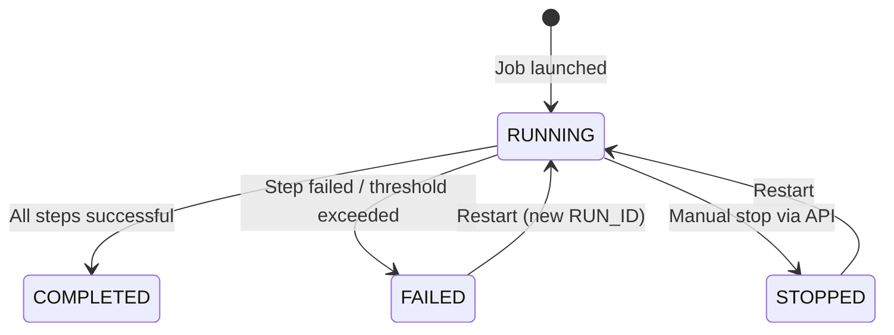

# ICA Context Document 13 — Error Handling Rules

**ICA Document ID:** ICA-13  
**Project:** CDP Snowflake to Oracle Data Loader  
**Version:** 1.0  
**Status:** Phase 1 — Approved  
**Last Updated:** 2025 (Phase 1)

---

## 1. Purpose

This document defines all rules governing error detection, isolation, recording, thresholds and restart after failure.

---

## 2. Error Philosophy

1. **Isolate bad records** — a single invalid record must not abort the entire step.
2. **Record every error** — all rejected records are written to `ETL_RECORD_ERROR` with enough information to diagnose and reprocess.
3. **No PII in error tables** — customer names, email and phone must not appear in error payloads.
4. **Configurable threshold** — if too many records fail, the step fails to protect data quality.
5. **Watermarks protect data integrity** — a failed step leaves the watermark unchanged.
6. **Restartability** — all errors must leave the system in a state that allows a clean restart.

---

## 3. Error Classification

| Error Class | Code Prefix | Description | Action |
|-------------|-------------|-------------|--------|
| Validation — Fatal | VAL-* | Missing mandatory field, invalid enumeration, FK not found | REJECT record |
| Validation — Warning | WARN-* | Invalid email/phone (record still loaded with field nulled) | LOG; continue |
| Transformation Error | TRANS-* | Unexpected exception during transformation | REJECT record |
| FK Resolution Failure | VAL-FK-001 | Parent entity not found in FK cache | REJECT record |
| Database Write Error | DB-* | Oracle JDBC exception on MERGE | LOG; retry up to 3 times; then REJECT |
| System Error | SYS-* | Snowflake JDBC connection failure; Oracle connection failure | FAIL step immediately |

---

## 4. Fatal Error Threshold

| Rule ID | Rule |
|---------|------|
| EH-THRESH-01 | A configurable `etl.fatal-error-threshold-percent` (default: 5) defines the maximum percentage of records that may be rejected within a single chunk before the step is failed. |
| EH-THRESH-02 | The threshold is evaluated per chunk, not per step. `rejected_count / chunk_size * 100 > threshold` → fail step. |
| EH-THRESH-03 | When the threshold is exceeded, the step is marked FAILED, the current chunk is NOT committed, and the job stops. |
| EH-THRESH-04 | The threshold value is configurable in `application.yml` and overridable per job via REST API job parameter. |

---

## 5. ETL_RECORD_ERROR Specification

Every rejected record writes one row to `CDP_CTL.ETL_RECORD_ERROR`:

| Column | Value | Notes |
|--------|-------|-------|
| ERROR_ID | Sequence | Auto-generated |
| RUN_ID | Job run ID | FK → ETL_JOB_RUN |
| JOB_NAME | Job class name | e.g., `DailyIncrementalJob` |
| SOURCE_ENTITY | Entity name | e.g., `CUSTOMER` |
| SOURCE_RECORD_ID | Source PK as string | Non-PII: ID only, never name/email |
| ERROR_CODE | Structured code | e.g., `VAL-EMAIL-001` |
| ERROR_MESSAGE | Human-readable | Max 1000 chars |
| PAYLOAD_EXCERPT | JSON-like excerpt | Non-PII fields only; max 500 chars |
| OCCURRED_AT | UTC timestamp | When error was detected |
| CREATED_AT | UTC timestamp | When row was written |

### 5.1 Safe Payload Excerpt Construction

```
Allowed in PAYLOAD_EXCERPT:
  - SOURCE_RECORD_ID (ID only)
  - Non-PII fields: CUSTOMER_TYPE, ACCOUNT_STATUS, START_DATE, etc.
  - Error context: field name, received value (for non-PII fields), expected pattern

NOT allowed in PAYLOAD_EXCERPT:
  - FIRST_NAME, LAST_NAME, MIDDLE_NAME, FULL_NAME
  - EMAIL_ADDRESS
  - PHONE_NUMBER
  - ADDRESS_LINE1, ADDRESS_LINE2, CITY (contact address)
  - BILLING_ACCOUNT_NUMBER
```

---

## 6. Spring Batch Skip Policy

The Spring Batch `SkipPolicy` is configured to:

1. Allow skip for:
   - `ValidationException` (all VAL-* errors)
   - `TransformationException` (all TRANS-* errors)
   - `FkResolutionException`
2. NOT allow skip for:
   - `SnowflakeConnectionException` (SYS-* — fail immediately)
   - `OracleConnectionException` (SYS-* — fail immediately)
   - Any `Error` (JVM error — fail immediately)
3. Skip limit per step: calculated as `Math.ceil(chunk_size * threshold / 100.0)`; exceeding this limit fails the step.

---

## 7. Error Recovery and Restart

| Rule ID | Rule |
|---------|------|
| EH-RECV-01 | After a FAILED step, the watermark remains at the last successfully committed chunk. |
| EH-RECV-02 | Restarting the job re-runs from the failed step's last safe watermark. |
| EH-RECV-03 | Records that were successfully committed before the failure are not reprocessed (they pass through MERGE as no-ops). |
| EH-RECV-04 | The original FAILED job run retains status FAILED in ETL_JOB_RUN. A new run ID is created on restart. |
| EH-RECV-05 | System errors (SYS-*) require investigation before restart; the dashboard shows the error message. |

---

## 8. ETL_JOB_RUN Status Lifecycle



---

## 9. Alerting (Future)

Phase 1 design note: the application does not send external alerts. Future phases may add:
- Email notification on FAILED status
- Prometheus metric for error rate
- Dashboard warning badge when last run FAILED

---

## 10. Error Code Master Table

| Code | Scenario | Entity | Fatal? |
|------|----------|--------|--------|
| VAL-CODE-001 | CODE_ID is null | CODE_VALUE | Yes |
| VAL-CODE-002 | CODE_DOMAIN is blank | CODE_VALUE | Yes |
| VAL-CUST-001 | CUSTOMER_ID is null | CUSTOMER | Yes |
| VAL-CUST-002 | FIRST_NAME is blank | CUSTOMER | Yes |
| VAL-CUST-003 | LAST_NAME is blank | CUSTOMER | Yes |
| VAL-CUST-005 | CUSTOMER_TYPE invalid | CUSTOMER | Yes |
| VAL-STATUS-001 | ACCOUNT_STATUS not translatable | CUSTOMER, ENERGY_ACCOUNT | Yes |
| VAL-EMAIL-001 | Email format invalid | CUSTOMER_CONTACT | No (null field) |
| VAL-PHONE-001 | Phone format invalid | CUSTOMER_CONTACT | No (null field) |
| VAL-FK-001 | Parent FK not resolved | All child entities | Yes |
| VAL-USAGE-001 | BILLING_MONTH format invalid | MONTHLY_USAGE | Yes |
| VAL-USAGE-003 | BILL_END_DATE not after START | MONTHLY_USAGE | Yes |
| VAL-USAGE-005 | KWH_USAGE negative | MONTHLY_USAGE | Yes |
| VAL-USAGE-006 | PEAK_DEMAND_KW negative | MONTHLY_USAGE | Yes |
| VAL-USAGE-011 | Bill total inconsistency > $0.01 | MONTHLY_USAGE | No (variance recorded) |
| TRANS-001 | Unexpected transformation exception | Any | Yes |
| DB-001 | Oracle JDBC error after retries | Any | Yes |
| SYS-001 | Snowflake connection failure | Any | Step immediate fail |
| SYS-002 | Oracle connection failure | Any | Step immediate fail |
